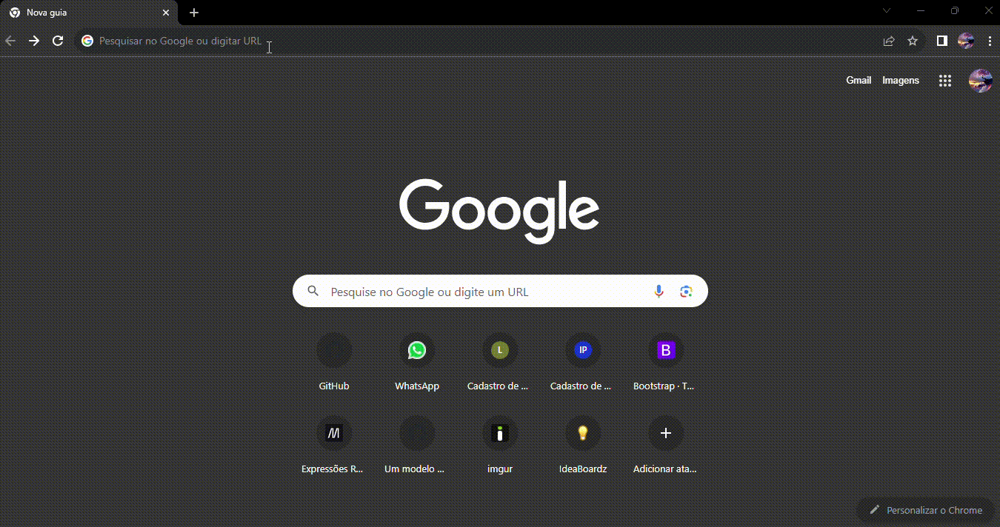

## Descrição 📝
Nesse projeto pegamos um código do Bootstrap 5 de layout e colocamos no VScode, a forma que iremos utilizar é para um usúario cadastrar o seu endereço.  
Passo a passo de como pegar o código do bootstrap:  
Primerio vai na barra de pesquisa Bootstrap 5, vai entrar no link, na tela principal do Bootstrap vai olha no canto esquerdo da tela e irá em forms, dentro de forms vai ter Layout, quando estiver layout vai no canto superior da tela direita e ir em Gutters, aí estará o modelo de como ficará o projeto e os código que usou.  
Irei deixar um video do mesmo passo a passo para facilitar caso mesmo assim não entenda o processo.  
   

Modificações:  
Mudamos textos, mexemos no cool (que seria para almentar ou diminuir o tamanho do label) e algumas estilizações usando css.

inicializado Javascript
no html colocamos o link de ligação para Javascript
e dentro de Javascript colocamos strict mode

## ⚙️Funcionalidades 
Com o código já pronto, ele ficará dessa forma.

## ♾️Fontes Consultadas
[Bootstrap](https://getbootstrap.com/docs/5.0/getting-started/introduction/) - Link do Bootstrap  

## Tecnologias Utilizadas
🟣JavaScript  
🟣HTML  
🟣Bootstrap  
🟣CSS  
